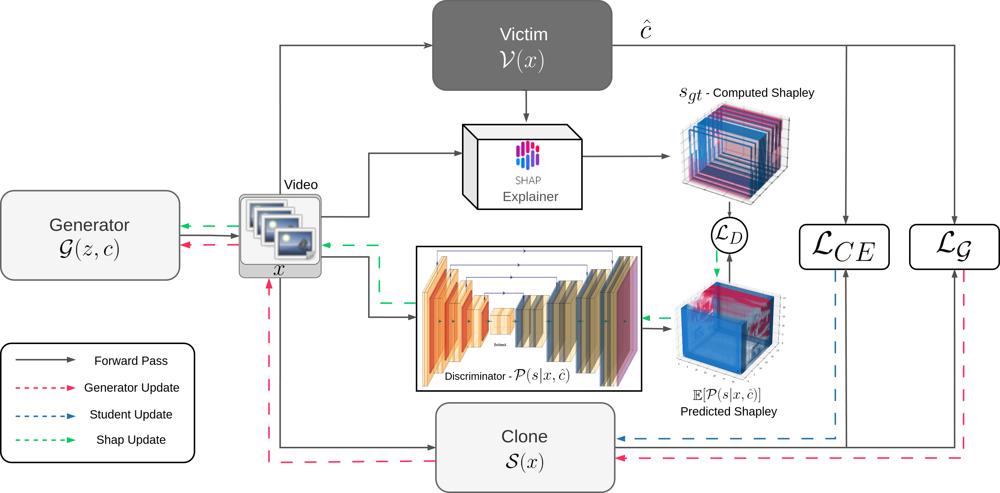

# VidModEx: Interpretable and Efficient Black Box Model Extraction for High-Dimensional Spaces

This is the official code for the paper submission of Vidmodex

## Illustration of Approach



Simplified illustration of the approach

## Installation

```bash
$ git clone --recursive https://github.com/vidmodex/vidmodex
$ pip install -e vidmodex/
```

## Usage
Simple shell command explaining the usage :

### BlackBox Extraction using Vidmodex or Shap Objective

```bash
$ cd vidmodex/
$ python main_shap_blackbox.py
$ python main_shap_blackbox.py --config ./vidmodex/configs/shap_something_something_v2_condtgan_victim_swint_clone_swint.yaml
```

All the configs can be found in `vidmodex/configs/`. The config with prefix shap are supported for shap based extraction.
One can edit or add new config files to support their training. While the default paramters are present in `vidmodex/config_args.py`,
can be passed through configfile under the `config_args` header or using arguement to the script.

Below is the usage for the script listing all possible argument available.

```bash
$ python main_shap_blackbox.py -h
[2024-05-21 14:47:37,611] [INFO] [real_accelerator.py:110:get_accelerator] Setting ds_accelerator to cuda (auto detect)
usage: main_shap_blackbox.py [-h] [--config CONFIG] [--accelerator ACCELERATOR] [--batch_size BATCH_SIZE] [--batch_size_gram BATCH_SIZE_GRAM] [--batch_size_train BATCH_SIZE_TRAIN]
                             [--batch_size_val BATCH_SIZE_VAL] [--batch_size_z BATCH_SIZE_Z] [--clone_optimizer CLONE_OPTIMIZER] [--d_iter D_ITER] [--devices DEVICES] [--dist_n DIST_N]
                             [--epoch_itrs EPOCH_ITRS] [--forward_differences FORWARD_DIFFERENCES] [--frames_per_video FRAMES_PER_VIDEO] [--g_iter G_ITER] [--gen_loss GEN_LOSS]
                             [--gen_optimizer GEN_OPTIMIZER] [--grad_epsilon GRAD_EPSILON] [--grad_m GRAD_M] [--log_dir LOG_DIR] [--log_every_epoch LOG_EVERY_EPOCH] [--log_interval LOG_INTERVAL]
                             [--logit_correction LOGIT_CORRECTION] [--loss LOSS] [--lr_G LR_G] [--lr_S LR_S] [--lr_V LR_V] [--momentum MOMENTUM] [--n_hyper_class N_HYPER_CLASS] [--no_logits NO_LOGITS]
                             [--num_nodes NUM_NODES] [--nz NZ] [--query_budget QUERY_BUDGET] [--rec_grad_norm REC_GRAD_NORM] [--resume RESUME] [--scale SCALE] [--scheduler SCHEDULER] [--seed SEED]
                             [--steps STEPS] [--store_checkpoints STORE_CHECKPOINTS] [--val_every_epoch VAL_EVERY_EPOCH] [--val_topk_accuracy VAL_TOPK_ACCURACY] [--victim_train_loss VICTIM_TRAIN_LOSS]
                             [--victim_train_momentum VICTIM_TRAIN_MOMENTUM] [--victim_train_optimizer VICTIM_TRAIN_OPTIMIZER] [--victim_train_scale VICTIM_TRAIN_SCALE]
                             [--victim_train_scheduler VICTIM_TRAIN_SCHEDULER] [--victim_train_steps VICTIM_TRAIN_STEPS] [--victim_train_weight_decay VICTIM_TRAIN_WEIGHT_DECAY]
                             [--weight_decay WEIGHT_DECAY]

options:
  -h, --help            show this help message and exit
  --config CONFIG
  --accelerator ACCELERATOR
  --batch_size BATCH_SIZE
  --batch_size_gram BATCH_SIZE_GRAM
  --batch_size_train BATCH_SIZE_TRAIN
  --batch_size_val BATCH_SIZE_VAL
  --batch_size_z BATCH_SIZE_Z
  --clone_optimizer CLONE_OPTIMIZER
  --d_iter D_ITER
  --devices DEVICES
  --dist_n DIST_N
  --epoch_itrs EPOCH_ITRS
  --forward_differences FORWARD_DIFFERENCES
  --frames_per_video FRAMES_PER_VIDEO
  --g_iter G_ITER
  --gen_loss GEN_LOSS
  --gen_optimizer GEN_OPTIMIZER
  --grad_epsilon GRAD_EPSILON
  --grad_m GRAD_M
  --log_dir LOG_DIR
  --log_every_epoch LOG_EVERY_EPOCH
  --log_interval LOG_INTERVAL
  --logit_correction LOGIT_CORRECTION
  --loss LOSS
  --lr_G LR_G
  --lr_S LR_S
  --lr_V LR_V
  --momentum MOMENTUM
  --n_hyper_class N_HYPER_CLASS
  --no_logits NO_LOGITS
  --num_nodes NUM_NODES
  --nz NZ
  --query_budget QUERY_BUDGET
  --rec_grad_norm REC_GRAD_NORM
  --resume RESUME
  --scale SCALE
  --scheduler SCHEDULER
  --seed SEED
  --steps STEPS
  --store_checkpoints STORE_CHECKPOINTS
  --val_every_epoch VAL_EVERY_EPOCH
  --val_topk_accuracy VAL_TOPK_ACCURACY
  --victim_train_loss VICTIM_TRAIN_LOSS
  --victim_train_momentum VICTIM_TRAIN_MOMENTUM
  --victim_train_optimizer VICTIM_TRAIN_OPTIMIZER
  --victim_train_scale VICTIM_TRAIN_SCALE
  --victim_train_scheduler VICTIM_TRAIN_SCHEDULER
  --victim_train_steps VICTIM_TRAIN_STEPS
  --victim_train_weight_decay VICTIM_TRAIN_WEIGHT_DECAY
  --weight_decay WEIGHT_DECAY
```


### BlackBox Extraction using DFME
```bash
$ cd vidmodex/
$ python main_blackbox.py
$ python main_blackbox.py --config ./vidmodex/configs/dfme_caltech256_gan256_victim_efficient_b7_clone_efficient_b7.yaml
```

All the configs can be found in `vidmodex/configs/`. The config with prefix dfme are supported for dfme based extraction.
One can edit or add new config files to support their training.While the default paramters are present in `vidmodex/config_args.py`,
can be passed through configfile under the `config_args` header or using arguement to the script.

Below is the usage for the script listing all possible argument available.

```bash
python main_blackbox.py -h
[2024-05-21 14:47:37,611] [INFO] [real_accelerator.py:110:get_accelerator] Setting ds_accelerator to cuda (auto detect)
usage: main_blackbox.py [-h] [--config CONFIG] [--accelerator ACCELERATOR] [--batch_size BATCH_SIZE] [--batch_size_gram BATCH_SIZE_GRAM] [--batch_size_train BATCH_SIZE_TRAIN]
                        [--batch_size_val BATCH_SIZE_VAL] [--batch_size_z BATCH_SIZE_Z] [--clone_optimizer CLONE_OPTIMIZER] [--d_iter D_ITER] [--devices DEVICES] [--dist_n DIST_N]
                        [--epoch_itrs EPOCH_ITRS] [--forward_differences FORWARD_DIFFERENCES] [--frames_per_video FRAMES_PER_VIDEO] [--g_iter G_ITER] [--gen_loss GEN_LOSS]
                        [--gen_optimizer GEN_OPTIMIZER] [--grad_epsilon GRAD_EPSILON] [--grad_m GRAD_M] [--log_dir LOG_DIR] [--log_every_epoch LOG_EVERY_EPOCH] [--log_interval LOG_INTERVAL]
                        [--logit_correction LOGIT_CORRECTION] [--loss LOSS] [--lr_G LR_G] [--lr_S LR_S] [--lr_V LR_V] [--momentum MOMENTUM] [--n_hyper_class N_HYPER_CLASS] [--no_logits NO_LOGITS]
                        [--num_nodes NUM_NODES] [--nz NZ] [--query_budget QUERY_BUDGET] [--rec_grad_norm REC_GRAD_NORM] [--resume RESUME] [--scale SCALE] [--scheduler SCHEDULER] [--seed SEED]
                        [--steps STEPS] [--store_checkpoints STORE_CHECKPOINTS] [--val_every_epoch VAL_EVERY_EPOCH] [--val_topk_accuracy VAL_TOPK_ACCURACY] [--victim_train_loss VICTIM_TRAIN_LOSS]
                        [--victim_train_momentum VICTIM_TRAIN_MOMENTUM] [--victim_train_optimizer VICTIM_TRAIN_OPTIMIZER] [--victim_train_scale VICTIM_TRAIN_SCALE]
                        [--victim_train_scheduler VICTIM_TRAIN_SCHEDULER] [--victim_train_steps VICTIM_TRAIN_STEPS] [--victim_train_weight_decay VICTIM_TRAIN_WEIGHT_DECAY] [--weight_decay WEIGHT_DECAY]

options:
  -h, --help            show this help message and exit
  --config CONFIG
  --accelerator ACCELERATOR
  --batch_size BATCH_SIZE
  --batch_size_gram BATCH_SIZE_GRAM
  --batch_size_train BATCH_SIZE_TRAIN
  --batch_size_val BATCH_SIZE_VAL
  --batch_size_z BATCH_SIZE_Z
  --clone_optimizer CLONE_OPTIMIZER
  --d_iter D_ITER
  --devices DEVICES
  --dist_n DIST_N
  --epoch_itrs EPOCH_ITRS
  --forward_differences FORWARD_DIFFERENCES
  --frames_per_video FRAMES_PER_VIDEO
  --g_iter G_ITER
  --gen_loss GEN_LOSS
  --gen_optimizer GEN_OPTIMIZER
  --grad_epsilon GRAD_EPSILON
  --grad_m GRAD_M
  --log_dir LOG_DIR
  --log_every_epoch LOG_EVERY_EPOCH
  --log_interval LOG_INTERVAL
  --logit_correction LOGIT_CORRECTION
  --loss LOSS
  --lr_G LR_G
  --lr_S LR_S
  --lr_V LR_V
  --momentum MOMENTUM
  --n_hyper_class N_HYPER_CLASS
  --no_logits NO_LOGITS
  --num_nodes NUM_NODES
  --nz NZ
  --query_budget QUERY_BUDGET
  --rec_grad_norm REC_GRAD_NORM
  --resume RESUME
  --scale SCALE
  --scheduler SCHEDULER
  --seed SEED
  --steps STEPS
  --store_checkpoints STORE_CHECKPOINTS
  --val_every_epoch VAL_EVERY_EPOCH
  --val_topk_accuracy VAL_TOPK_ACCURACY
  --victim_train_loss VICTIM_TRAIN_LOSS
  --victim_train_momentum VICTIM_TRAIN_MOMENTUM
  --victim_train_optimizer VICTIM_TRAIN_OPTIMIZER
  --victim_train_scale VICTIM_TRAIN_SCALE
  --victim_train_scheduler VICTIM_TRAIN_SCHEDULER
  --victim_train_steps VICTIM_TRAIN_STEPS
  --victim_train_weight_decay VICTIM_TRAIN_WEIGHT_DECAY
  --weight_decay WEIGHT_DECAY
```


## Available Modules
Below we list the available models, transforms and datasets that we have tested while newer modules can easily be added and a brief description of the same is given below

### Available Models
#### Image Models

```
- resnet18, resnet34, resnet50, resnet101, resnet152
- vgg11, vgg11_bn, vgg13, vgg13_bn, vgg16, vgg16_bn, vgg19, vgg19_bn
- alexnet
- efficientnet_b0, efficientnet_b1, efficientnet_b2, efficientnet_b3, efficientnet_b4, efficientnet_b5, efficientnet_b6, efficientnet_b7
- mobilenet_v2
- shufflenet_v2_x0_5, shufflenet_v2_x1_0, shufflenet_v2_x1_5, shufflenet_v2_x2_0
- inception_v3
- densenet121, densenet169, densenet201, densenet161
- googlenet
- mnasnet0_5, mnasnet0_75, mnasnet1_0, mnasnet1_3
- resnext50_32x4d, resnext101_32x8d
- wide_resnet50_2, wide_resnet101_2
- squeezenet1_0, squeezenet1_1
```
To add more models one can import the model at `vidmodex/models/images/__init__.py`
and Add it using

```python
Model.register("model_name")(model_class_or_model_init_func)
```

#### Video Models

```
- ViViT
- SwinT
- MoviNet-A0, MovieNet-A1, MovieNet-A5, MovieNet-A6
```
To add more models one can import the model at `vidmodex/models/videos/__init__.py`
and Add it using

```python
Model.register("model_name")(model_class_or_model_init_func)
```
### Datasets
#### Image dataset

```
- ImageNet 
- CIFAR10 
- CIFAR100 
- MNIST 
- Caltech101 
- Caltech256
```
To add more dataset one can import the definition at `vidmodex/utils/dataloader.py`
and Add it using

```python
DatasetFactory.register("dataset_name")(dataset_class_or_dataset_init_func)
```
#### Video dataset
```
- UCF11 
- UCF101 
- Kinetics400 
- Kinetics600
- Something-Something-v2
```
They all share the same dataset class to unify data loading.
To add new dataset the same process as image dataset can be used

### Transforms

Transforms are vital for interacting between dataset or generator output and model.
To unify the training process we require definitions of both, they are present in `vidmodex/utils/tensorTransforms.py`, `vidmodex/utils/imageTransforms.py` and `vidmodex/utils/videoTransforms.py`. 

If you add your own model it would require the 2 transforms, to add it import it into `vidmodex/utils/__init__.py` and

```python
TensorTransformFactory.register(f"img2{model_name}")(model_transform_for_dataset_from_PIL_or_tensor)

TensorTransformFactory.register(f"gan2{model_name}")(model_transform_for_gen_output_from_tensor_only)
```


## File Structure

This is for reference if one wants to experiment his own model or algorithm he may change that specific module / part

```bash
vidmodex
.
├── vidmodex
│    ├── config_args.py
│    ├── configs         ## Contains all the configs to run experiment
│    │   ├── dfme_caltech101_gan256_victim_efficientnet_b7_clone_efficientnet_b7.yaml
│    │   ├── dfme_caltech256_gan256_victim_efficient_b7_clone_efficient_b7.yaml
│    │   ├── dfme_cifar100_gan32_victim_efficientnet_b7_clone_efficientnet_b7.yaml
│    │   ├── dfme_cifar10_gan32_victim_resnet18_clone_resnet18.yaml
│    │   ├── dfme_imagenet1k_gan224_victim_resnet152_clone_resnet152.yaml
│    │   ├── dfme_kin400_tgan_victim_swint_clone_vivit.yaml
│    │   ├── dfme_kin600_tgan_victim_swint_clone_swint.yaml
│    │   ├── dfme_mnist_gan28_victim_resnet18_clone_resnet18.yaml
│    │   ├── dfme_something_something_v2_tgan_victim_swint_clone_swint.yaml
│    │   ├── dfme_ucf101_tgan_victim_vivit_clone_vivit.yaml
│    │   ├── dfme_ucf11_tgan_victim_vivit_clone_vivit.yaml
│    │   ├── shap_caltech101_condgan256_victim_efficientnet_b7_clone_efficientnet_b7.yaml
│    │   ├── shap_caltech256_condgan256_victim_efficient_b7_clone_efficient_b7.yaml
│    │   ├── shap_cifar100_condgan32_victim_efficientnet_b7_clone_efficientnet_b7.yaml
│    │   ├── shap_cifar10_condgan32_victim_resnet18_clone_resnet18.yaml
│    │   ├── shap_imagenet1k_condgan224_victim_resnet152_clone_resnet152.yaml
│    │   ├── shap_kin400_condtgan_victim_swint_clone_vivit.yaml
│    │   ├── shap_kin600_condtgan_victim_swint_clone_swint.yaml
│    │   ├── shap_mnist_condgan32_victim_resnet18_clone_resnet18.yaml
│    │   ├── shap_something_something_v2_condtgan_victim_swint_clone_swint.yaml
│    │   ├── shap_ucf101_condtgan_victim_vivit_clone_vivit.yaml
│    │   └── shap_ucf11_condtgan_victim_vivit_clone_vivit.yaml
│    ├── generator                           ## Contains all generator
│    │   ├── condTgan.py
│    │   ├── imgGan.py
│    │   ├── __init__.py
│    │   ├── new_gan.py
│    │   ├── ref_gan.py
│    │   ├── shap_discriminator.py
│    │   └── Tgan.py
│    ├── __init__.py
│    ├── loss                               ## Contains custom and standard losses
│    │   ├── custom_loss.py
│    │   ├── gram_matrix.py
│    │   ├── __init__.py
│    │   └── shap_loss.py
│    ├── models                             ## Contains all model definitions
│    │   ├── abstract_model.py
│    │   ├── bbmodel_wrapper.py
│    │   ├── image
│    │   │   ├── __init__.py
│    │   │   └── models.py
│    │   ├── __init__.py
│    │   ├── optimizer.py
│    │   └── video
│    │       ├── __init__.py
│    │       ├── movinet
│    │       │   ├── config.py
│    │       │   ├── __init__.py
│    │       │   └── models.py
│    │       ├── swint
│    │       │   ├── accuracy.py
│    │       │   ├── head.py
│    │       │   ├── __init__.py
│    │       │   ├── losses.py
│    │       │   ├── recognizer.py
│    │       │   └── swint.py
│    │       └── vivit
│    │           ├── __init__.py
│    │           ├── module.py
│    │           └── vivit.py
│    ├── optim                           ## Zeroth Order Gradient approximation
│    │   ├── approximate_gradients.py
│    │   └── __init__.py
│    ├── tests
│    │   ├── __init__.py
│    │   ├── shap_test.py
│    │   ├── single_test.py
│    │   ├── validation.ipynb
│    │   └── vivit_model.ipynb
│    ├── train                           ## Contains training loop for each Pipeline
│    │   ├── __init__.py
│    │   ├── train_blackbox.py
│    │   ├── train_blackbox_shap.py
│    │   ├── train_gram.py
│    │   ├── train_greybox.py
│    │   └── train_greybox_shap.py
│    └── utils                           ## Contains argparser, callbacks, dataloader and auxilary functions
│        ├── arg_config.py
│        ├── callbacks.py
│        ├── dataloader.py
│        ├── imageTransforms.py
│        ├── __init__.py
│        ├── load_weight.py
│        ├── tensorTransforms.py
│        └── videoTransforms.py
│
├── environment.yml                 ## To reproduce the target environment
├── setup.py
├── train_victim_model.py           ## To train a victim model for extracting
├── main_blackbox.py                ## DFME based black box extraction
└── main_shap_blackbox.py           ## Shap based black box extraction

17 directories, 94 files
```
